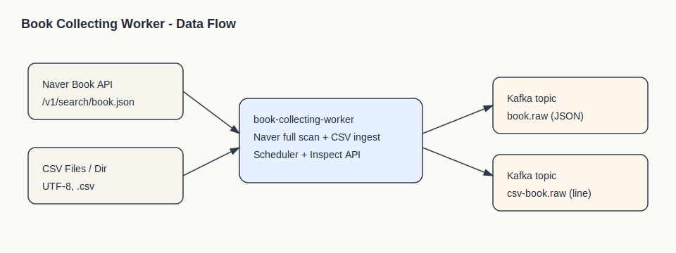

# book-collecting-worker

## 1. 프로젝트 Description
도서 메타데이터를 수집해 Kafka로 스트리밍하는 수집 워커입니다.  
Naver Book API 풀스캔 수집과 CSV 파일 수집을 지원하며, 운영 점검용 API와 Prometheus 메트릭을 제공합니다.



## 2. 프로젝트 정보

### 설치
- Java 21 설치
- Kafka 브로커 준비 (SASL/SCRAM-SHA-256 기본 가정)
- Naver Book API 인증 정보 준비

### 컴파일 방법
```
./gradlew build
```

JAR 실행:
```
java -jar build/libs/book-collecting-worker-0.0.1-SNAPSHOT.jar
```

### 사용 환경
- Java 21
- Kafka (SASL/SCRAM 설정 기본)
- Naver Book API 인증 정보

### 간단한 사용 방법 및 예제

환경 변수(또는 `.env`) 예시:
```
KAFKA_BOOTSTRAP_SERVERS=broker:9092
KAFKA_SASL_USERNAME=your-username
KAFKA_SASL_PASSWORD=your-password
NAVER_BOOK_CLIENT_ID=your-client-id
NAVER_BOOK_CLIENT_SECRET=your-client-secret
CSV_BOOK_FILE_PATH=/path/to/csv-or-dir
```

로컬 실행:
```
./gradlew bootRun
```

Naver 수집 배치 트리거 (기본 포트 8080):
```
curl -X POST http://localhost:8080/internal/naver/collect/full-scan
```

CSV 자동 수집 활성화:
- `csv.book.runner.enabled=true`
- `csv.book.file-path` 또는 `CSV_BOOK_FILE_PATH`를 파일/디렉터리로 지정

주요 설정 값(기본값은 `src/main/resources/application.yaml`):
```
naver.search.display=100
naver.search.max-start=1000
naver.search.sort=date
naver.kafka.topic=book.raw

csv.book.file-path=/path/to/csv-or-dir
csv.book.runner.enabled=false
csv.book.kafka.topic=csv-book.raw
```

Kafka 토픽 및 메시지 포맷:
- `book.raw`: Naver Book API 응답 아이템 JSON
- `csv-book.raw`: CSV 원본 라인 문자열

Actuator:
- `GET /internal/health`
- `GET /internal/info`
- `GET /internal/prometheus`

## 3. Contribute
- 버그/개선 제안은 이슈로 먼저 공유해 주세요.
- 새 기능은 브랜치를 분리해 작업하고, PR에 변경 이유와 테스트 결과를 적어 주세요.
- 변경 전/후 동작이 있는 경우, 재현 방법을 포함해 주세요.
- 가능한 경우 `./gradlew test` 실행 결과를 첨부해 주세요.
